# BIỂU ĐỒ PHÂN RÃ CHỨC NĂNG (FUNCTIONAL DECOMPOSITION DIAGRAM - FDD)

## 2.9 Biểu đồ phân rã chức năng hệ thống
Biểu đồ phân rã chức năng (FDD) đóng vai trò then chốt trong việc làm rõ cấu trúc kiến trúc phần mềm, giúp chia nhỏ hệ thống lớn thành các phân hệ chức năng độc lập, từ đó đi sâu vào chi tiết các tác vụ nghiệp vụ cụ thể. Hệ thống thương mại điện tử đồng hồ **DongHo** được phân rã thành 3 phân hệ lớn chính bao gồm: **Phân hệ Khách hàng (Frontend)**, **Phân hệ Quản trị (Backend / Admin Dashboard)** và **Phân hệ Tích hợp thông minh AI (AI Service)**.

### 2.9.1 Sơ đồ phân rã chức năng (FDD Diagram)

```mermaid
graph TD
    %% Định nghĩa Style cho Sơ đồ
    classDef default fill:#ffffff,stroke:#000000,stroke-width:1px,color:#000000;
    classDef root fill:#f2f2f2,stroke:#000080,stroke-width:2px,color:#000080,font-weight:bold;
    classDef level1 fill:#f9f9f9,stroke:#000080,stroke-width:1.5px,color:#000080,font-weight:bold;
    
    %% Các Nút Cốt Lõi
    ROOT["WEBSITE THƯƠNG MẠI ĐIỆN TỬ DONGHO"]:::root
    
    %% Phân hệ Cấp 1
    FE["Phân hệ Khách hàng (Frontend)"]:::level1
    BE["Phân hệ Quản trị (Admin Dashboard)"]:::level1
    AI["Phân hệ Tích hợp thông minh (AI Service)"]:::level1
    
    ROOT --> FE
    ROOT --> BE
    ROOT --> AI
    
    %% Phân hệ Khách hàng (FE) - Cấp 2
    FE_AUTH["Quản lý Tài khoản"]
    FE_CAT["Catalog Sản phẩm"]
    FE_CART["Giỏ hàng & Thanh toán"]
    FE_INT["Tương tác & Tin tức"]
    
    FE --> FE_AUTH
    FE --> FE_CAT
    FE --> FE_CART
    FE --> FE_INT
    
    %% Phân hệ Khách hàng (FE) - Cấp 3
    FE_AUTH --> FE_AUTH_1["Đăng ký tài khoản (Xác thực OTP)"]
    FE_AUTH --> FE_AUTH_2["Đăng nhập (Hệ thống / Google OAuth)"]
    FE_AUTH --> FE_AUTH_3["Quản lý hồ sơ cá nhân"]
    FE_AUTH --> FE_AUTH_4["Danh sách yêu thích (Wishlist)"]
    
    FE_CAT --> FE_CAT_1["Duyệt sản phẩm theo Danh mục/Hãng"]
    FE_CAT --> FE_CAT_2["Tìm kiếm & Lọc thông minh (Giá, Máy, Màu...)"]
    FE_CAT --> FE_CAT_3["Xem chi tiết (Thông số, Album, Mô tả AI)"]
    
    FE_CART --> FE_CART_1["Quản lý giỏ hàng (Thêm/Sửa/Xóa)"]
    FE_CART --> FE_CART_2["Áp dụng mã giảm giá (Coupon)"]
    FE_CART --> FE_CART_3["Thanh toán linh hoạt (COD / VNPay / VietQR)"]
    
    FE_INT --> FE_INT_1["Viết đánh giá sản phẩm (Nhận xét, Số sao)"]
    FE_INT --> FE_INT_2["Xem tin tức & Bình luận bài viết"]
    FE_INT --> FE_INT_3["Gửi thư góp ý, phản hồi (Contact)"]
    
    %% Phân hệ Quản trị (BE) - Cấp 2
    BE_SYS["Quản trị Hệ thống"]
    BE_CAT["Quản trị Danh mục & Hãng"]
    BE_PROD["Quản trị Sản phẩm"]
    BE_ORD["Quản trị Đơn hàng"]
    BE_INT["Quản trị Khuyến mãi & Tương tác"]
    BE_STAT["Báo cáo & Thống kê"]
    
    BE --> BE_SYS
    BE --> BE_CAT
    BE --> BE_PROD
    BE --> BE_ORD
    BE --> BE_INT
    BE --> BE_STAT
    
    %% Phân hệ Quản trị (BE) - Cấp 3
    BE_SYS --> BE_SYS_1["Quản lý tài khoản (Users) & Phân quyền"]
    BE_SYS --> BE_SYS_2["Giám sát hệ thống & Nhật ký hoạt động AI"]
    
    BE_CAT --> BE_CAT_1["Quản lý danh mục sản phẩm (Đa cấp)"]
    BE_CAT --> BE_CAT_2["Quản lý hãng & Thương hiệu đối tác"]
    BE_CAT --> BE_CAT_3["Quản lý Banner quảng cáo trang chủ"]
    
    BE_PROD --> BE_PROD_1["Thêm/Sửa/Xóa đồng hồ (Sản phẩm)"]
    BE_PROD --> BE_PROD_2["Quản lý Album ảnh chi tiết & Tồn kho"]
    BE_PROD --> BE_PROD_3["Kích hoạt AI tự động viết bài mô tả sản phẩm"]
    
    BE_ORD --> BE_ORD_1["Tiếp nhận & Xác nhận trạng thái đơn hàng"]
    BE_ORD --> BE_ORD_2["Cập nhật trạng thái vận đơn & Giao nhận"]
    BE_ORD --> BE_ORD_3["Đối soát giao dịch thanh toán trực tuyến"]
    
    BE_INT --> BE_INT_1["Quản lý mã giảm giá (Coupons)"]
    BE_INT --> BE_INT_2["Duyệt đánh giá (Reviews) & Tin tức (News)"]
    BE_INT --> BE_INT_3["Phản hồi thư liên hệ & Bình luận khách hàng"]
    
    BE_STAT --> BE_STAT_1["Thống kê doanh thu (Theo tuần/tháng/năm)"]
    BE_STAT --> BE_STAT_2["Báo cáo tồn kho & Sản phẩm bán chạy"]
    BE_STAT --> BE_STAT_3["Thống kê hiệu quả & Token tiêu hao của AI"]

    %% Phân hệ AI - Cấp 2
    AI_GEMINI["AI Gemini Integration Service"]
    
    AI --> AI_GEMINI
    
    %% Phân hệ AI - Cấp 3
    AI_GEMINI --> AI_1["AI Content Generation (Viết mô tả sản phẩm)"]
    AI_GEMINI --> AI_2["AI Sentiment Analysis (Phân tích cảm xúc review)"]
    AI_GEMINI --> AI_3["AI Spam Protection (Tự động quét spam bình luận)"]
    AI_GEMINI --> AI_4["AI Title Suggestion (Đề xuất tiêu đề tin tức)"]
```

---

### 2.9.2 Mô tả chi tiết chức năng các phân hệ

#### 1. Phân hệ Khách hàng (Frontend)
Phân hệ này cung cấp giao diện trực quan, thân thiện giúp tối ưu hóa hành trình mua sắm và tương tác trực tiếp của khách hàng trên hệ thống:
* **Quản lý Tài khoản:** Cho phép khách hàng đăng ký tài khoản mới (xác thực tính chính chủ thông qua mã OTP gửi về Email), đăng nhập linh hoạt bằng tài khoản hệ thống hoặc thông qua liên kết Google OAuth nhanh chóng. Người dùng có thể quản lý thông tin cá nhân, thiết lập địa chỉ giao hàng mặc định và quản lý danh sách sản phẩm yêu thích (Wishlist).
* **Catalog Sản phẩm:** Khách hàng có thể duyệt qua danh sách đồng hồ phân loại theo danh mục hoặc theo các hãng thương hiệu nổi tiếng. Hệ thống cung cấp công cụ bộ lọc thông minh (lọc theo khoảng giá, bộ máy Quartz/Automatic, chất liệu vỏ, chất liệu dây, kích thước mặt số...) cùng tính năng tìm kiếm nhanh theo tên. Trang chi tiết sản phẩm hiển thị đầy đủ thông số kỹ thuật, slide ảnh chụp góc cạnh và bài viết giới thiệu tiếp thị cuốn hút do AI tạo.
* **Giỏ hàng & Đặt hàng:** Cho phép người dùng thêm sản phẩm vào giỏ, cập nhật số lượng, áp dụng các mã giảm giá (Coupon) hợp lệ. Quy trình thanh toán hỗ trợ 3 hình thức đa dạng bao gồm: Thanh toán khi nhận hàng (COD), Thanh toán online qua cổng VNPay, hoặc quét mã VietQR chuyển khoản nhanh hiển thị động theo hóa đơn.
* **Tương tác & Tin tức:** Khách hàng sau khi đặt mua sản phẩm có quyền gửi đánh giá sao và viết nhận xét thực tế. Khách hàng cũng có thể đọc các bài viết tin tức thời trang đồng hồ, gửi bình luận trao đổi bên dưới bài viết hoặc gửi thư liên hệ góp ý, phản hồi dịch vụ tới bộ phận chăm sóc khách hàng.

#### 2. Phân hệ Quản trị (Admin Dashboard)
Phân hệ dành riêng cho ban quản trị và nhân viên vận hành, cung cấp các công cụ quản lý, kiểm soát toàn diện mọi hoạt động kinh doanh và tối ưu tài nguyên hệ thống:
* **Quản trị Hệ thống:** Quản lý toàn bộ danh sách tài khoản người dùng, thực hiện kích hoạt/khóa tài khoản vi phạm. Phân quyền vai trò truy cập giữa Quản trị viên tối cao (Admin) và Nhân viên. Giám sát các lượt ghi nhận nhật ký giao dịch và mức độ tiêu thụ tài nguyên của hệ thống AI (ai_logs).
* **Quản trị Danh mục & Hãng:** Quản lý cây danh mục sản phẩm (thêm, sửa, ẩn/hiển thị danh mục theo cấu trúc đệ quy đa cấp) và danh sách thương hiệu đối tác. Thiết lập hình ảnh slide trình chiếu quảng cáo (Banners) hiển thị ở trang chủ để định hình chiến dịch tiếp thị.
* **Quản trị Sản phẩm:** Cho phép thiết lập thông số kỹ thuật chi tiết của đồng hồ, cập nhật số lượng tồn kho thực tế, tải lên album ảnh góc cạnh chi tiết. Đồng thời tích hợp nút chức năng gọi API AI Gemini để tự động tạo ra nội dung mô tả đồng hồ tiếp thị chuẩn SEO từ các thông số kỹ thuật sẵn có chỉ bằng 1 lượt nhấp chuột.
* **Quản trị Đơn hàng:** Tiếp nhận đơn hàng mới lập tức, hỗ trợ bộ lọc trạng thái xử lý đơn (Chờ duyệt, Đã xác nhận, Đang giao, Đã giao, Đã hủy). Đối soát tình trạng thanh toán thực tế của các đơn online qua VNPay/VietQR trước khi bàn giao cho đơn vị vận chuyển.
* **Quản trị Khuyến mãi & Tương tác:** Thiết lập các chương trình khuyến mãi (mã coupons giảm giá theo tiền mặt hoặc tỷ lệ %). Quản lý phê duyệt/bác bỏ các đánh giá sản phẩm của khách hàng, quản lý và đăng tải tin tức, phê duyệt các bình luận dưới bài viết và trả lời các bức thư góp ý liên hệ của người dùng trực tiếp.
* **Báo cáo & Thống kê:** Cung cấp biểu đồ trực quan hóa dữ liệu thống kê doanh số bán hàng, số lượng đơn hàng theo chu kỳ thời gian (tuần, tháng, năm), báo cáo mức độ tồn kho và danh sách sản phẩm bán chạy nhất giúp đưa ra quyết định nhập hàng tối ưu.

#### 3. Phân hệ Tích hợp thông minh AI (AI Service)
Đây là phân hệ kỹ thuật hiện đại, đóng vai trò xử lý các tác vụ phân tích thông minh, giúp tự động hóa vận hành và tăng trải nghiệm người dùng dựa trên việc tích hợp mô hình ngôn ngữ lớn (LLM - Gemini API):
* **AI Content Generation:** Tự động tổng hợp thông số kỹ thuật của một mẫu đồng hồ để viết thành một bài mô tả giới thiệu tiếp thị giàu tính thuyết phục, định hướng hành vi mua sắm chuẩn SEO, giúp tiết kiệm tối đa thời gian nhập liệu thủ công cho quản trị viên.
* **AI Sentiment Analysis:** Tự động phân tích sâu nội dung nhận xét viết bằng văn bản của khách hàng trong mục Đánh giá sản phẩm để nhận diện cảm xúc (Tích cực - Positive, Trung lập - Neutral, Tiêu cực - Negative) đi kèm điểm số cảm xúc (Sentiment score) chi tiết giúp Admin nhanh chóng nắm bắt phản hồi tiêu cực để xử lý kịp thời.
* **AI Spam Protection:** Tự động quét và phân tích nội dung bình luận mới của khách hàng dưới các bài viết tin tức nhằm phát hiện sớm các từ ngữ thô tục, quảng cáo không lành mạnh hoặc thông tin spam, tự động gắn cờ gắn nhãn cảnh báo để ngăn chặn phát tán nội dung rác trên website.
* **AI Title Suggestion:** Trích xuất nhanh nội dung cốt lõi của một bài viết tin tức thời trang đồng hồ từ bản nháp của tác giả, từ đó tự động gợi ý ra các tiêu đề hấp dẫn, bắt mắt giúp tối ưu hóa lượt nhấp chuột (click-through rate) của người đọc.
